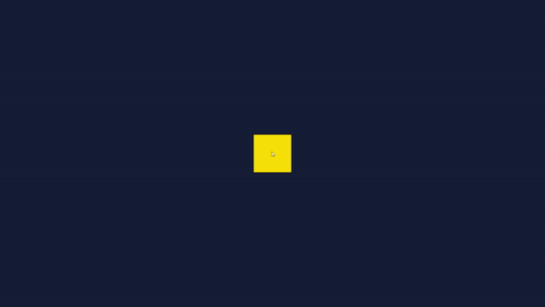

# interactive-3d-cube
JavaScript Canvas를 활용하여 마우스로 움직일 수 있는 3D Cube를 구현해본 프로젝트입니다.

## About The Project

* 마우스 드래그를 통해 큐브를 회전시킬 수 있습니다.
* 드래그 시작점, 드래그가 끝나는 점을 기준으로 속도와 회전방향을 조절합니다.

## Built With

* JavaScript
* canvas

## Getting Started

* `index.html` 파일을 실행하여 로컬환경에서 동작 시킬 수 있습니다.